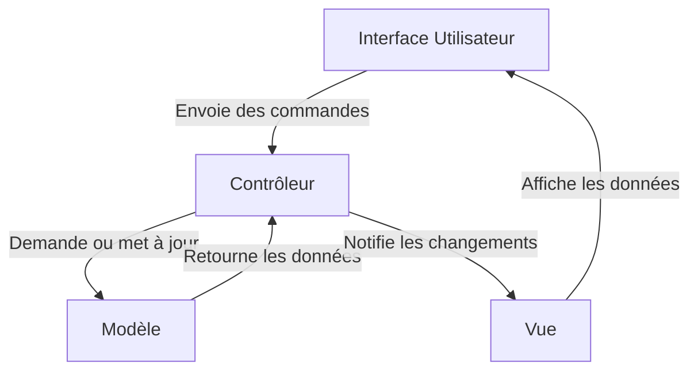
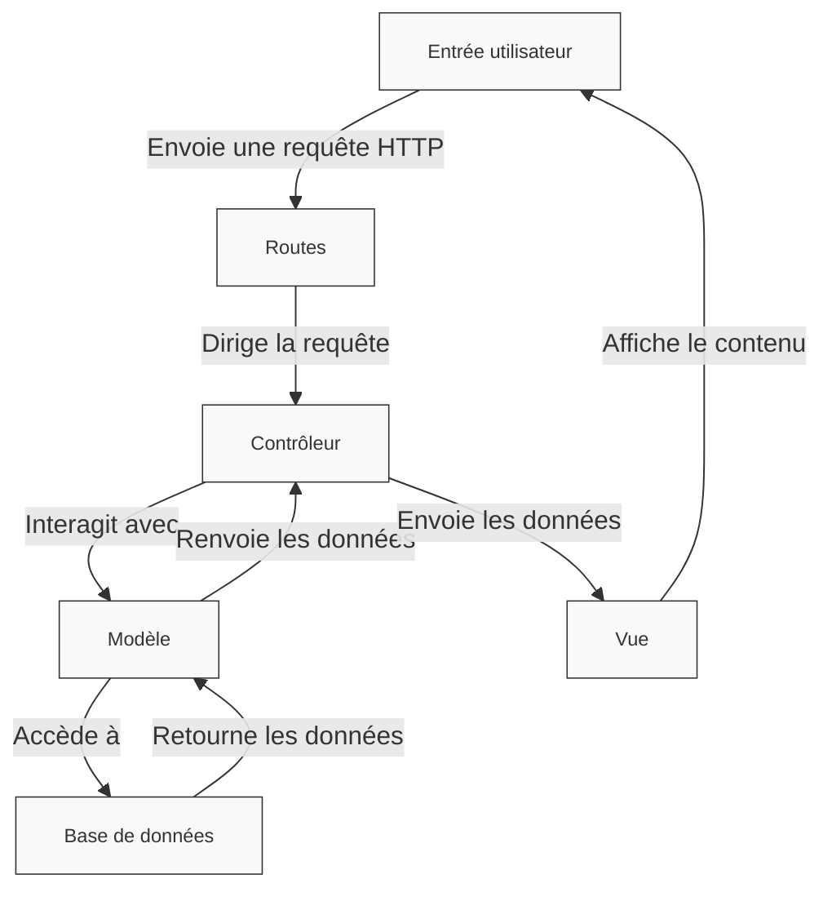

#

  ETML - P_Bulle Dev - Charmier Grégory - 2025
  <a href="https://github.com/GregLeBarbar" target="_blank" class="slidev-icon-btn">
    <carbon:logo-github />
  </a>

<!--
Pas de notes
-->

---

# Qu'est-ce qu'AdonisJS ?

  <strong>AdonisJS</strong> est un framework web orienté <strong>TypeScript</strong> pour créer des applications web et des serveurs d'API.

✨ Il offre un support intégré pour :

- 🚀 Les tests
- 🛠️ Des outils modernes
- 🌟 Un écosystème de packages officiels

Et bien plus encore !

---

# Le slogan d'AdonisJS ?

  Créez des applications backend sur mesure en un temps record 🚀

---

# Pourquoi étudier AdonisJS ?

  Le constat : Plan de fomation propose soit :

- module 293 : Application HTML5 / CSS3
- modules 294 et 295 : Application découpée en <strong>Front-end</strong> et <strong>Back-end</strong>

On passe un peu du 🐓 à 🐴 !

En entreprise, on utilise encore aujourd'hui beaucoup des Frameworks MVC.

Comme Django (python), Laravel (PHP), Spring MVC (Java), etc

---

# Mais qu'est ce qu'un Framework ?

<h2>Définition :</h2>

Un <strong>framework</strong> est un ensemble d'outils, de bibliothèques et de conventions conçu pour <strong>simplifier</strong> et <strong>standardiser</strong> le développement d'applications logicielles. Il fournit une <strong>structure réutilisable</strong> et des <strong>fonctionnalités de base</strong> pour <strong>construire rapidement</strong> des applications en suivant des <strong>principes</strong> et des <strong>bonnes pratiques</strong> préétablis.

---

# CMS != Framework

<h2>Définition :</h2>
Un CMS (pour Content Management System, ou Système de Gestion de Contenu en français) est une application ou un logiciel qui permet de créer, gérer et modifier facilement le contenu d’un site web, souvent <strong>sans nécessiter de compétences techniques avancées en programmation</strong>.

---

# Pattern MVC

Le <strong>pattern MVC</strong> (Model-View-Controller) est un modèle d'architecture logicielle utilisé pour <strong>organiser</strong> et <strong>structurer</strong> le code d'une application. Il est particulièrement populaire dans le développement d'applications web et desktop, car il <strong>facilite la séparation des responsabilités, améliore la lisibilité du code et permet une maintenance plus facile</strong>.

---

# Le pattern MVC

---

# MVC avec AdonisJS

---

# CLI

Le <strong>C</strong>ommand <strong>L</strong>ine <strong>I</strong>nterface d’AdonisJS est un outil en ligne de commandes qui facilite le développement avec ce framework en offrant des commandes pour générer, gérer et exécuter les différents composants d’une application.

C'est un élément central dans le flux de travail d'AdonisJS, permettant de gagner du temps et de réduire les erreurs en automatisant des tâches courantes.

---

# CLI d'AdonisJS : Ace

---

# Commandes du CLI fréquemment utilisées

| **Commande**               | **Description**                         |
| -------------------------- | --------------------------------------- |
| `node ace serve --watch`   | Lance le serveur en mode développement. |
| `node ace make:controller` | Génère un contrôleur.                   |
| `node ace make:model`      | Génère un modèle.                       |
| `node ace make:migration`  | Génère une migration.                   |
| `node ace migration:run`   | Applique les migrations.                |
| `node ace make:middleware` | Génère un middleware.                   |
| `node ace test`            | Lance les tests de l'application.       |

---

# Apprendre par la pratique : app surnoms des enseignants

<a target="_blank" href="https://github.com/GregLeBarbar/application-surnoms-version-statique/archive/refs/heads/main.zip">https://github.com/GregLeBarbar/application-surnoms-version-statique/archive/refs/heads/main.zip</a>

---

# Etape 1 : Création du projet

Voir la doc officielle :

<a href="https://docs.adonisjs.com/guides/getting-started/installation">https://docs.adonisjs.com/guides/getting-started/installation</a>

Voilà la commande :

<pre style="font-size: 1em; line-height: 1.6; background-color: #f4f4f4; padding: 10px; border-radius: 5px;">
npm init adonisjs@latest app-teachers -- --db=mysql
</pre>

---

# Etape 1 : Création du projet

---

# CMS != Framework

---

# CMS != Framework

---
