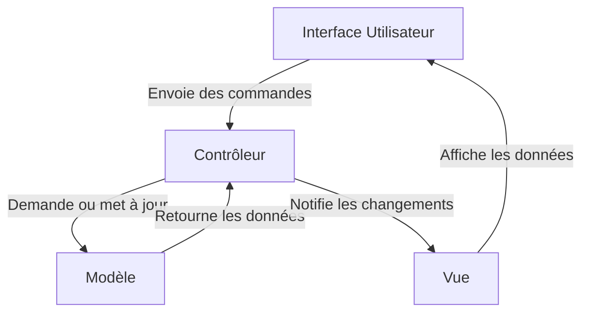
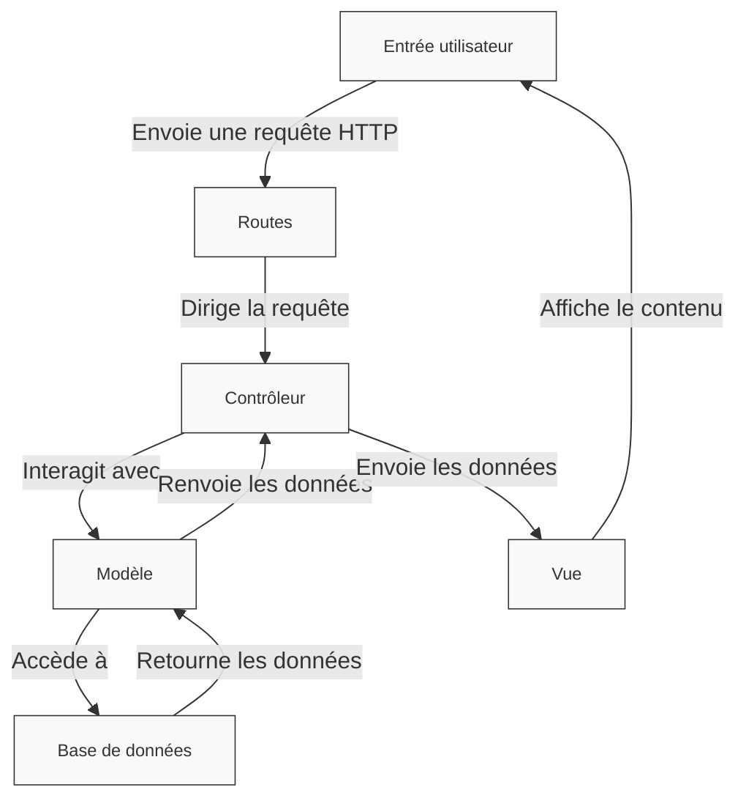

#

<div class="abs-br m-6 text-xl">
  ETML - P_Bulle Dev - Charmier Grégory - 2025
  <a href="https://github.com/GregLeBarbar" target="_blank" class="slidev-icon-btn">
    <carbon:logo-github />
  </a>
</div>

<!--
Pas de notes
-->

---

# Qu'est-ce qu'AdonisJS ?

<div class="content">
  <strong>AdonisJS</strong> est un framework web orienté <strong>TypeScript</strong> pour créer des applications web et des serveurs d'API.

✨ Il offre un support intégré pour :

- 🚀 Les tests
- 🛠️ Des outils modernes
- 🌟 Un écosystème de packages officiels

Et bien plus encore !

</div>

---

# Le slogan d'AdonisJS ?

<div class="content">
  Créez des applications backend sur mesure en un <span class="text-primary">temps record</span> 🚀
</div>

---

# Pourquoi étudier AdonisJS ?

<div class="content">
  Le constat : Plan de fomation propose soit :

- module 293 : Application HTML5 / CSS3
- modules 294 et 295 : Application découpée en <strong>Front-end</strong> et <strong>Back-end</strong>

On passe un peu du 🐓 à 🐴 !

En entreprise, on utilise encore aujourd'hui beaucoup des Frameworks MVC.

Comme Django (python), Laravel (PHP), Spring MVC (Java), etc

</div>

---

# Mais qu'est ce qu'un Framework ?

<div class="content" style="line-height: 2 !important">
<h2>Définition :</h2>

Un <strong>framework</strong> est un ensemble d'outils, de bibliothèques et de conventions conçu pour <strong>simplifier</strong> et <strong>standardiser</strong> le développement d'applications logicielles. Il fournit une <strong>structure réutilisable</strong> et des <strong>fonctionnalités de base</strong> pour <strong>construire rapidement</strong> des applications en suivant des <strong>principes</strong> et des <strong>bonnes pratiques</strong> préétablis.

</div>

---

# CMS != Framework

<div class="content">
<h2>Définition :</h2>
Un CMS (pour Content Management System, ou Système de Gestion de Contenu en français) est une application ou un logiciel qui permet de créer, gérer et modifier facilement le contenu d’un site web, souvent <strong>sans nécessiter de compétences techniques avancées en programmation</strong>.
</div>

---

# AdonisJS

<div class="content">
<ul>AdonisJS peut être utilisé pour développer :
<li>une API REST</li>
<li>une SPA (Single Page Application)</li>
<li>une application MVC</li>
<li>etc</li>
</ul>
</div>

---

# TypeScript

<div class="content">

<strong>TypeScript</strong> est un sur-ensemble de JavaScript qui <strong>ajoute des fonctionnalités de typage</strong> statique au langage. Cela signifie que vous pouvez définir les types des variables, des paramètres, des retours de fonctions, et plus encore, pour rendre votre code plus robuste et plus maintenable.

TypeScript est développé et maintenu par Microsoft et est largement utilisé dans les projets modernes, en particulier dans les applications de grande envergure ou complexes.

Nos fichiers auront donc l'extension <strong>.ts</strong>

</div>

---

# Pattern MVC

<div class="content">
Le <strong>pattern MVC</strong> (Model-View-Controller) est un modèle d'architecture logicielle utilisé pour <strong>organiser</strong> et <strong>structurer</strong> le code d'une application. Il est particulièrement populaire dans le développement d'applications web et desktop, car il <strong>facilite la séparation des responsabilités, améliore la lisibilité du code et permet une maintenance plus facile</strong>.
</div>

---

# Le pattern MVC



---

# MVC avec AdonisJS



---

# Route

<div class="content">
<h2>Définition :</h2>
Une <strong>route</strong>, dans un framework comme AdonisJS, est une définition qui <strong>associe une URL à une logique métier</strong> (une fonction ou un contrôleur). Les routes permettent de gérer les requêtes des utilisateurs et de retourner les réponses correspondantes.
</div>

---

# Vue

<div class="content">
<h2>Définition :</h2>
Une <strong>vue</strong> est un fichier qui contient du <strong>HTML combiné avec des balises dynamiques</strong> pour insérer des données générées par le serveur. Ces fichiers sont généralement gérés par un moteur de templates, tel que Edge dans AdonisJS.
</div>

---

# Gestionnaire de templates : EDGE

<div class="content">
<h2>Définition :</h2>
Un <strong>gestionnaire de templates</strong> (ou moteur de templates) est un outil ou une bibliothèque qui permet de <strong>générer du contenu HTML dynamique</strong> en combinant des fichiers de templates statiques avec des données dynamiques fournies par une application.

Ces gestionnaires simplifient le processus de création et de gestion des vues dans une application en <strong>séparant clairement la logique de présentation (HTML/CSS) de la logique métier</strong>.

</div>

---

# Contrôleur

<div class="content">
<h2>Définition :</h2>
Un <strong>contrôleur</strong> est un composant clé dans le cadre d’une <strong>architecture MVC</strong> (Model-View-Controller).

Il agit comme un <strong>intermédiaire entre la logique métier (modèles) et l'interface utilisateur (vues)</strong>. Son rôle principal est de traiter les requêtes entrantes, d’interagir avec les modèles pour récupérer ou manipuler des données, puis de retourner une réponse appropriée (souvent sous forme de vue ou de données JSON).

</div>

---

# Validateur

<div class="content">
<h2>Définition :</h2>
Un <strong>validateur</strong> est un outil ou une bibliothèque utilisée pour <strong>valider et filtrer les données fournies par les utilisateurs</strong> avant de les traiter ou de les enregistrer. Dans AdonisJS, VineJS est une bibliothèque de validation intégrée qui permet de valider les données des requêtes HTTP, comme les formulaires, les paramètres d'URL ou les corps JSON.
</div>

---

# Debug avec dd()

<div class="content">

La méthode <strong>dd()</strong> (abréviation de dump and die) est une fonction de débogage intégrée dans AdonisJS.

Elle permet d'afficher des informations utiles sur des variables, des objets ou d'autres données, puis d'arrêter immédiatement l'exécution du script.
import { dd } from '@adonisjs/core/services/dumper'

</div>

---

# Debug avec dd() - exemple

<div class="content">

```js
async index({ view }: HttpContext) {
    //
    // Récupérer la liste des enseignants triés par ordre alphabétique sur le nom et le prénom
    const teachers = await Teacher.query().orderBy('lastname', 'asc').orderBy('firstname', 'asc')

    dd(teachers)

    // Appel de la vue
    return view.render('pages/home', { teachers })

}
```

</div>

---

# Modèle

<div class="content">
<h2>Définition :</h2>
Un <strong>modèle</strong> (ou Model) est une <strong>représentation logique et structurée des données</strong> dans une application. Il sert d'intermédiaire entre la base de données et le reste de l'application, permettant de gérer les interactions avec les données (comme la récupération, la création, la mise à jour et la suppression) tout en offrant une abstraction qui facilite le travail des développeurs.

Les modèles sont au cœur de l'<strong>architecture MVC</strong> (Model-View-Controller), où ils définissent les règles et la logique métier liées aux données.

</div>

---

# ORM : Lucid

<div class="content">
<h2>Définition :</h2>
Un <strong>ORM</strong> (Object-Relational Mapping, ou Mapping Objet-Relationnel) est un <strong>outil qui permet de manipuler une base de données relationnelle à travers des objets dans un langage de programmation</strong>. Cela simplifie les interactions avec la base de données en transformant les tables, colonnes et requêtes SQL en objets, propriétés, et méthodes.

Dans le cas d’AdonisJS, l’ORM intégré est <strong>Lucid</strong>, qui est conçu pour fournir une interface intuitive pour travailler avec des bases de données relationnelles comme MySQL, PostgreSQL, SQLite, etc.

</div>

---

# Migrations

<div class="content">
<h2>Définition :</h2>
Une <strong>migration</strong> est un <strong>mécanisme utilisé pour gérer les schémas de base de données</strong> dans le cadre d’un projet de développement. Elle permet de créer, modifier ou supprimer des tables et des colonnes dans une base de données de manière versionnée et contrôlée.

Les migrations sont particulièrement utiles dans les frameworks modernes comme AdonisJS, Laravel, Rails, ou Django, où elles offrent une manière structurée et collaborative de gérer l'évolution de la base de données tout au long du cycle de vie d'une application.

</div>

---

# Seeder

<div class="content">
<h2>Définition :</h2>
Un <strong>seeder</strong> est un script qui insère des <strong>données initiales ou fictives</strong> dans une base de données.

Il est utilisé pour :

- Peupler une base de données avec des données de démarrage (par exemple, rôles d'utilisateur, paramètres système).
- Créer des données pour le développement (par exemple, utilisateurs fictifs, produits de test).
- Faciliter les tests automatisés en configurant des données prédictibles.

</div>

---

# Factory

<div class="content">
Une <strong>factory</strong> (ou fabrique en français) est un outil utilisé dans le développement logiciel pour <strong>générer automatiquement des données fictives</strong> (dummy data) ou des données d'exemple.

Dans notre contexte, une factory est utilisée pour :

- Créer des objets ou des modèles avec des données cohérentes et réalistes.
- Remplir la base de données avec des enregistrements pour les tests ou le développement local.
- Automatiser la création d'entités comme des utilisateurs, des produits, des commandes, etc.

</div>

---

# Middleware

<div class="content">
<h2>Définition :</h2>
Un <strong>middleware</strong> est une fonction ou une classe dans un framework comme AdonisJS qui <strong>agit comme un intermédiaire entre la requête d'un utilisateur et la réponse renvoyée par le serveur</strong>. Il est utilisé pour <strong>intercepter et traiter les requêtes HTTP</strong> avant qu'elles n'atteignent les contrôleurs ou après que la réponse soit générée.
</div>

---

# CLI

<div class="content">
<h2>Définition :</h2>
Le <strong>Command Line Interface</strong> d’AdonisJS est un outil en ligne de commandes qui facilite le développement avec ce framework en <strong>offrant des commandes</strong> pour générer, gérer et exécuter les différents composants d’une application.

C'est un élément central dans le flux de travail d'AdonisJS, permettant de gagner du temps et de réduire les erreurs en automatisant des tâches courantes.

</div>

---

# CLI d'AdonisJS : Ace


---

# Commandes du CLI fréquemment utilisées

| **Commande**               | **Description**                         |
| -------------------------- | --------------------------------------- |
| `node ace serve --watch`   | Lance le serveur en mode développement. |
| `node ace make:controller` | Génère un contrôleur.                   |
| `node ace make:model`      | Génère un modèle.                       |
| `node ace make:migration`  | Génère une migration.                   |
| `node ace migration:run`   | Applique les migrations.                |
| `node ace make:middleware` | Génère un middleware.                   |
| `node ace test`            | Lance les tests de l'application.       |

---

# Apprendre par la pratique : app surnoms des enseignants


<a target="_blank" href="https://github.com/GregLeBarbar/application-surnoms-version-statique/archive/refs/heads/main.zip">main.zip</a>

---

# Les différentes étapes

<div class="content">

</div>

---

# Etape 0 : Création du projet

<div class="content">

Voir la doc officielle :

<a href="https://docs.adonisjs.com/guides/getting-started/installation">//docs.adonisjs.com/guides/getting-started/installation</a>

Voilà la commande :

<pre style="font-size: 1em; line-height: 1.6; background-color: #f4f4f4; padding: 10px; border-radius: 5px;">npm init adonisjs@latest app-teachers -- --db=mysql
</pre>

</div>

---

# Etape 0 : Création du projet

<div class="content">

</div>

---

# Etape 0 : Installation des extensions de vscode

<div class="content">
 3 extensions à installer :


</div>

---

# Questions ?
